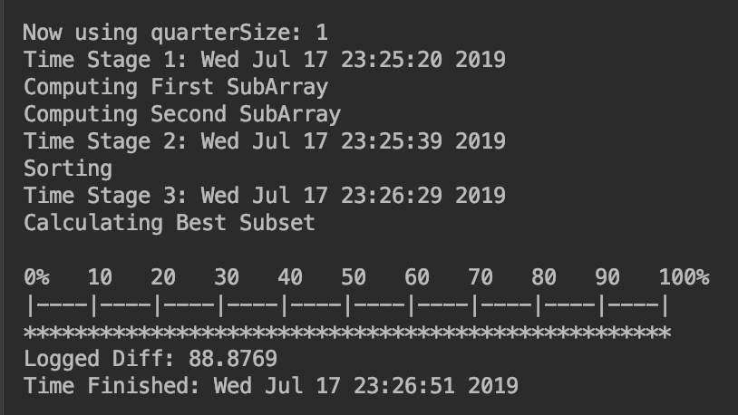

# meet-in-middle
Cryptography problem: Given the px is the xth prime number, e.g. p1 = 2, p2 = 3:

Let M = { floor(10^100 * (p_i)^(1/3) ) | 1 <= i <= 100 },

and S = 2 * ID Number * 10^94

Find a subset T that exists in M such that the sum of the elements in T is greater than or equal to S.

Attempting to find the smallest difference: sum(T) - S

####  Sample console output:

## Installation
- install cmake
- install git
- install nlohmann json (for c++ json)
- install gmp (used in ntl)
- install m4 (used in ntl)
- install ntl (used for big-integer calculations)
- install boost

## Running
- building: cmake -DCMAKE_BUILD_TYPE=Debug -G "CodeBlocks - Unix Makefiles" /path/to/project/middle
- running: path/to/projec middle/cmake-build-debug/middle
